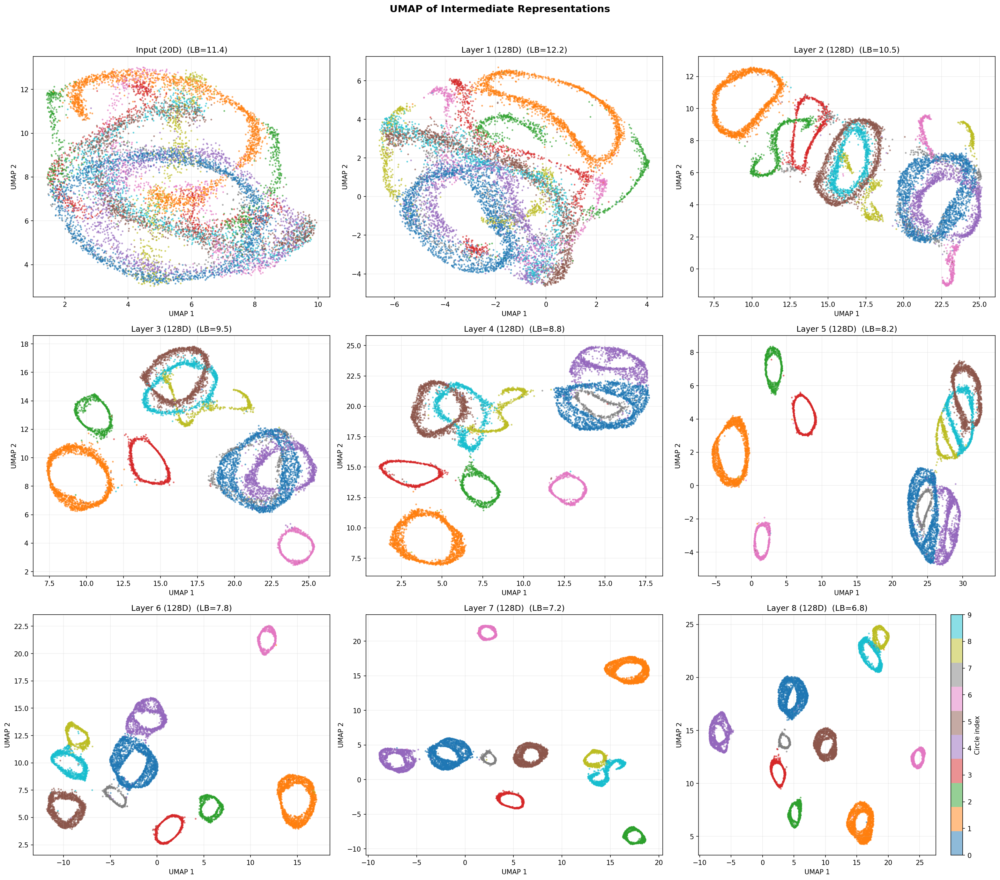
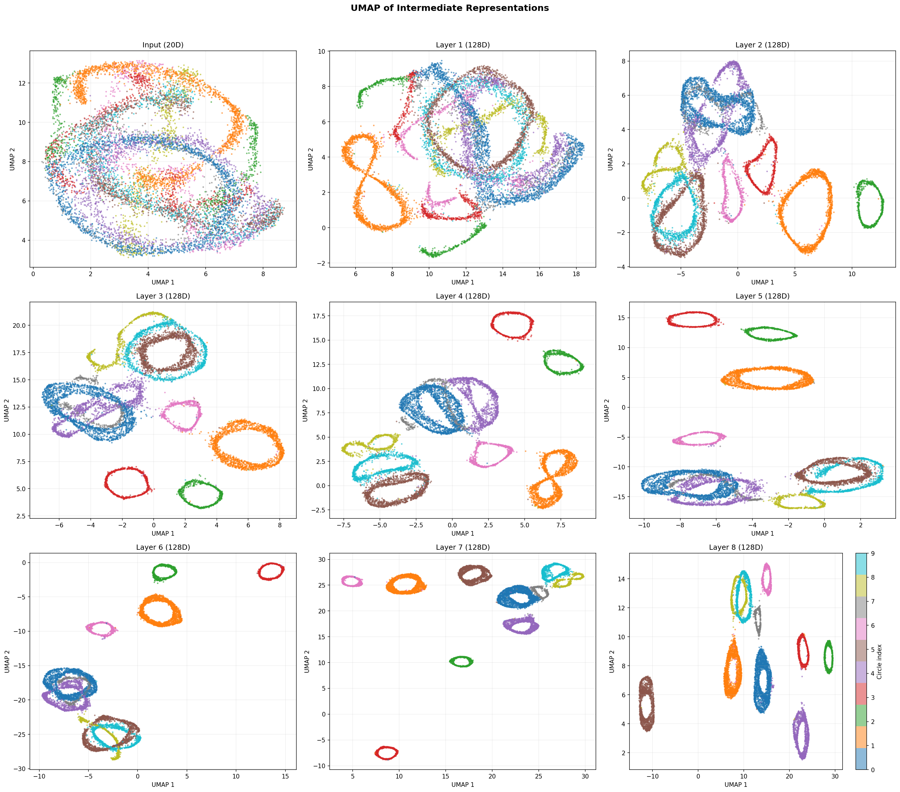
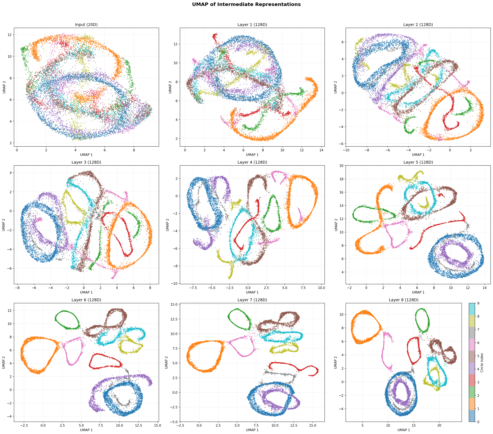

# Synthetic JEPA

Joint Embedding Predictive Architecture (JEPA) for masked prediction on synthetic time series data.

Instead of reconstructing masked observations in pixel/feature space (as in the BERT-style model in `synthetic-bert`), JEPA predicts **representations** of masked regions in latent space.

## Architecture

```
Context encoder : Input → mask → Linear(20→D) → RoPE Transformer (N layers) → D-dim reps
                  (optional) → Bottleneck(D → B → D)
Target encoder  : Input (full) → Linear(20→D) → RoPE Transformer (N layers) → D-dim reps
                  (optional) → Bottleneck(D → B → D)
                  (exponential moving average of context encoder, no gradients)
Predictor       : Context reps → replace masked with [PRED] token
                  → RoPE Transformer (M layers) → LayerNorm → Linear → D-dim predictions
Loss            : MSE(predictions[mask], target_reps[mask])
```

The target encoder is updated via EMA after each optimiser step, with a cosine momentum schedule from τ_base (0.996) → 1.0. The asymmetric architecture (shallow predictor + EMA target) prevents representation collapse without explicit regularisation.

### Concept-level representation strategies

Several flags encourage learning abstract, concept-level representations rather than detailed temporal ones:

| Strategy | Flag | Effect |
|----------|------|--------|
| Encoder/predictor asymmetry | `--n-layers 8 --predictor-n-layers 2` | Deep encoder + shallow predictor forces the encoder to do the heavy lifting |
| Large mask patches | `--mask-patch-min 10 --mask-patch-max 600` | Predicting long spans requires understanding high-level structure |
| High mask ratio | `--mask-ratio 0.5` or `0.9` | Extreme masking leaves very little context, forcing reliance on global features |
| Region-level loss | `--region-level` | Averages reps over each contiguous masked region before MSE |
| Information bottleneck | `--bottleneck-dim 16` | Compresses encoder output through a narrow layer (Linear→ReLU→Linear) on both paths |
| Small model dimension | `--d-model 32` | Limits representational capacity, forcing compression |

## Dataset

The synthetic dataset consists of 10 circles embedded in 20D ambient space with a shared 4D subspace (`--subspace-dim 4`). Dynamics are governed by a sparse random Markov transition matrix (each circle transitions heavily to 2–3 others and lightly to 3–4 more).

**Plane drift (`--drift`)**: Even-numbered circles (0, 2, 4, 6, 8) undergo gradual plane tilting during each visit — the 2D plane rotates toward a random orthogonal axis over the course of the syllable, then resets to its original orientation on the next visit. This introduces within-syllable non-stationarity that the model must learn to handle. The `--drift-rate` parameter controls the maximum tilt angle per syllable (default 0.5 rad; use 6.283 for one full rotation per visit).

## Experiment results

All runs use the drift dataset (`--drift --drift-rate 6.283`, `--subspace-dim 4`). UMAP plots show per-layer representations coloured by circle index. LB = Levina-Bickel intrinsic dimension estimate.

### Best result: 50% masking, 8L encoder / 1L predictor

`--mask-ratio 0.5 --n-layers 8 --predictor-n-layers 1 --seq-len 1000 --mask-patch-min 10 --mask-patch-max 600 --epochs 500`



Clean circle separation by layer 7–8 (LB 6.4). Train/val curves track closely — no overfitting due to EMA regularisation and self-supervised targets.

### Deep encoder (8L/1L), seq 1000, mask 10–600

`--n-layers 8 --predictor-n-layers 1 --seq-len 1000 --mask-patch-min 10 --mask-patch-max 600 --epochs 1000`



### Information bottleneck (dim=16)

`--bottleneck-dim 16 --mask-ratio 0.5 --n-layers 8 --predictor-n-layers 1 --seq-len 1000 --epochs 500`



16-dim bottleneck was too aggressive — compressed representations lost circle identity. The encoder layers (1–7) never separated circles because the narrow bottleneck blocked gradient signal.

### JEPA vs BERT on noisy data — depth scaling (noise_std ≈ 5)

The key advantage of JEPA over BERT emerges under high observation noise. With `noise_std ≈ 5` (SNR ≈ 0.8), individual timesteps are nearly pure noise — the circle signal is only recoverable by aggregating across many timesteps.

BERT reconstructs raw observations, wasting capacity on unpredictable noise. JEPA predicts in representation space, where noise averages out naturally.

Both models use identical encoder architecture (d_model=128, 4 heads, RoPE), the same data, masking (`--mask-ratio 0.5 --mask-patch-min 10 --mask-patch-max 600`), and training schedule (1000 epochs, batch 128). JEPA has a 2-layer predictor.

#### 6-layer encoder

| | JEPA | BERT |
|---|---|---|
| Trainable params | ~1.6M | ~1.3M |
| Best epoch | 832 | 879 |

**JEPA 6L** (silhouette 0.45 at layer 6):


**BERT 6L** (silhouette 0.21 at layer 6):


#### 8-layer encoder

| | JEPA | BERT |
|---|---|---|
| Trainable params | ~1.8M | ~1.7M |
| Best epoch | 965 | 993 |

**JEPA 8L** (silhouette 0.56 at layer 8):


**BERT 8L** (silhouette 0.21 at layer 8):


#### 12-layer encoder

| | JEPA | BERT |
|---|---|---|
| Trainable params | ~2.8M | ~2.5M |
| Best epoch | 961 | 901 |

**JEPA 12L** (silhouette 0.56 at layer 12):


**BERT 12L** (silhouette 0.42 at layer 12):


#### Silhouette score summary (final encoder layer)

| Depth | JEPA | BERT | JEPA / BERT |
|-------|------|------|-------------|
| 6L | 0.447 | 0.209 | 2.1× |
| 8L | 0.564 | 0.205 | 2.8× |
| 12L | 0.565 | 0.423 | 1.3× |

**Key findings**:

- **JEPA is consistently better** at every depth on this noisy dataset.
- **JEPA saturates around 8 layers** — going to 12L doesn't improve its final silhouette (0.564 → 0.565). The representation-level objective extracts the latent structure efficiently.
- **BERT benefits much more from depth** — it jumps from 0.21 (6L/8L) to 0.42 (12L). The reconstruction objective needs more capacity to develop abstract representations as a byproduct.
- **JEPA's advantage is largest at moderate depth** (8L, 2.8×) where it has already achieved near-peak performance while BERT has not.
- **BERT's output projection destroys structure** — silhouette drops to negative values at the output layer at every depth, confirming the reconstruction objective pulls representations back toward noisy observation space.

### Other runs

| Run | Checkpoint | Key observation |
|-----|-----------|-----------------|
| 4L, mask 16–256, 500ep | `jepa_model.pt` | Baseline, moderate separation |
| 4L, mask 400, 500ep | `jepa_model_mask400.pt` | Larger patches improve separation |
| 4L, d_model=32, 500ep | `jepa_model_d32.pt` | Compressed dim gives tight clusters but noisy |
| 8L/1L, mask 10–600, 500ep | `jepa_model_seq1000_mask10_600.pt` | Good separation, improved by longer training |
| 8L/2L, stride 32, 1000ep | `jepa_model_stride32.pt` | More data from overlapping windows |
| 8L/2L, 500ep | `jepa_model_pred2.pt` | 2-layer predictor converges faster than 1-layer |
| Region-level loss | `jepa_model_region.pt` | Did not improve over standard MSE loss |
| Bottleneck context-only | `jepa_model_bottleneck16.pt` | Arms race instability — loss rebounds after epoch 200 |
| noise_std ≈ 10 | `jepa_model_noisy10.pt` | Too noisy — no separation in 500 epochs |
| JEPA 6L, noisy5, 1000ep | `jepa_model_noisy5_6L.pt` | Silhouette 0.45 — depth scaling comparison |
| JEPA 8L, noisy5, 1000ep | `jepa_model_noisy5.pt` | Silhouette 0.56 — near-peak performance |
| JEPA 12L, noisy5, 1000ep | `jepa_model_noisy5_12L.pt` | Silhouette 0.57 — saturated, no gain over 8L |

## GPU optimisations

- BF16 mixed precision (`torch.amp`)
- `torch.compile` (Inductor backend)
- GPU-preloaded dataset (entire dataset moved to VRAM when it fits)
- GPU-accelerated k-NN for UMAP (`torch.cdist` + `topk`)
- GPU-accelerated silhouette score
- GPU-accelerated Levina-Bickel dimension estimation
- `cudnn.benchmark`, `zero_grad(set_to_none=True)`

## Setup

```bash
python -m venv venv
source venv/bin/activate
pip install numpy matplotlib torch scipy umap-learn
```

## Usage

### Generate dataset

```bash
# Static circles
python markov_circles_timeseries.py --subspace-dim 4 --no-umap

# With plane drift (even circles tilt one full rotation per syllable)
python markov_circles_timeseries.py --subspace-dim 4 --drift --drift-rate 6.283 --no-umap

# High-noise regime (noise_std ≈ 5, where JEPA outshines BERT)
python markov_circles_timeseries.py --subspace-dim 4 --drift --noise-scale 1.77 --no-umap
```

### Train

```bash
# Standard run
python jepa_model_gpu.py --epochs 500

# Concept-level: deep encoder, high masking, large patches
python jepa_model_gpu.py --n-layers 8 --predictor-n-layers 1 \
    --mask-ratio 0.5 --mask-patch-min 10 --mask-patch-max 600 \
    --seq-len 1000 --epochs 500 --checkpoint jepa_model_concept.pt

# With information bottleneck
python jepa_model_gpu.py --bottleneck-dim 32 --epochs 500

# Disable torch.compile (useful for debugging or when compile hangs)
python jepa_model_gpu.py --no-compile --epochs 500
```

### Evaluate representations (UMAP + Levina-Bickel)

```bash
# Full evaluation (UMAP + LB dimension + silhouette scores)
python evaluate_representations.py --checkpoint jepa_model.pt

# Fast evaluation (UMAP + LB only, skip silhouette)
python evaluate_representations.py --checkpoint jepa_model.pt --no-sil

# Specify layers
python evaluate_representations.py --checkpoint jepa_model.pt --layers input,1,4,8
```

## Files

| File | Description |
|------|-------------|
| `jepa_model_gpu.py` | JEPA model definition and GPU-optimised training loop |
| `dataset.py` | `SyntheticSongDataset` — sliding-window + patch masking |
| `masked_model_gpu.py` | Shared `RoPETransformerEncoderLayer` (imported by JEPA) |
| `evaluate_representations.py` | UMAP visualisation, Levina-Bickel dimension, silhouette scores (GPU-accelerated) |
| `estimate_dimension.py` | Levina-Bickel estimator (GPU-accelerated) |
| `markov_circles_timeseries.py` | Synthetic dataset generator |

## References

### JEPA architecture

- Assran et al. (2023). *Self-Supervised Learning from Images with a Joint-Embedding Predictive Architecture*. CVPR 2023. [[arXiv]](https://arxiv.org/abs/2301.08243) — The foundational I-JEPA paper: predicting in latent space with EMA target encoder and shallow predictor.
- LeCun (2022). *A Path Towards Autonomous Machine Intelligence*. Technical report. [[openreview]](https://openreview.net/forum?id=BZ5a1r-kVsf) — Position paper laying out the JEPA philosophy and hierarchical world models.
- Bardes et al. (2024). *V-JEPA: Latent Video Prediction for Visual Representation Learning*. [[openreview]](https://openreview.net/forum?id=WFYbBOEOtv) — Extends JEPA to video with temporal masking, most relevant to time series settings.

### EMA target networks

- Grill et al. (2020). *Bootstrap Your Own Latent: A New Approach to Self-Supervised Learning*. NeurIPS 2020. [[arXiv]](https://arxiv.org/abs/2006.07733) — Pioneered EMA target networks for self-supervised learning without negative pairs.
- Baevski et al. (2022). *data2vec: A General Framework for Self-Supervised Learning in Speech, Vision and Language*. ICML 2022. [[arXiv]](https://arxiv.org/abs/2202.03555) — Unified latent prediction with EMA teacher across modalities.

### Masking strategies

- He et al. (2022). *Masked Autoencoders Are Scalable Vision Learners*. CVPR 2022. [[arXiv]](https://arxiv.org/abs/2111.06377) — Extensive analysis of mask ratios; found 75% optimal for images.

### Information bottleneck

- Tishby, Pereira & Bialek (2000). *The Information Bottleneck Method*. [[arXiv]](https://arxiv.org/abs/physics/0004057) — Foundational theory of the compression–prediction tradeoff.
- Alemi et al. (2017). *Deep Variational Information Bottleneck*. ICLR 2017. [[arXiv]](https://arxiv.org/abs/1612.00410) — Variational approximation enabling neural-network-parameterised bottlenecks.
- Shwartz-Ziv & Tishby (2017). *Opening the Black Box of Deep Neural Networks via Information*. [[arXiv]](https://arxiv.org/abs/1703.00810) — Analyses layer-by-layer compression in deep networks through the information plane.

### Representation learning

- Bengio, Courville & Vincent (2013). *Representation Learning: A Review and New Perspectives*. IEEE TPAMI. [[arXiv]](https://arxiv.org/abs/1206.5538) — Defines desirable properties of learned representations (disentanglement, abstraction, invariance).
- Bardes, Ponce & LeCun (2022). *VICReg: Variance-Invariance-Covariance Regularization for Self-Supervised Learning*. ICLR 2022. [[arXiv]](https://arxiv.org/abs/2105.04906) — Explicit regularisation against dimensional collapse.

### Time series self-supervised learning

- Yue et al. (2022). *TS2Vec: Towards Universal Representation of Time Series*. AAAI 2022. [[arXiv]](https://arxiv.org/abs/2106.10466) — Hierarchical contrastive learning for multi-scale time series representations.
- Tonekaboni, Eytan & Goldenberg (2021). *Unsupervised Representation Learning for Time Series with Temporal Neighborhood Coding*. ICLR 2021. [[openreview]](https://openreview.net/forum?id=8qDwejCuCN) — Contrastive learning using temporal neighbourhood stationarity.
