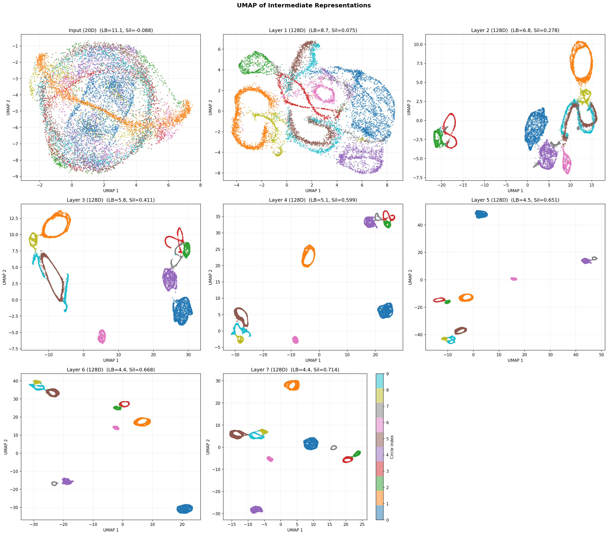
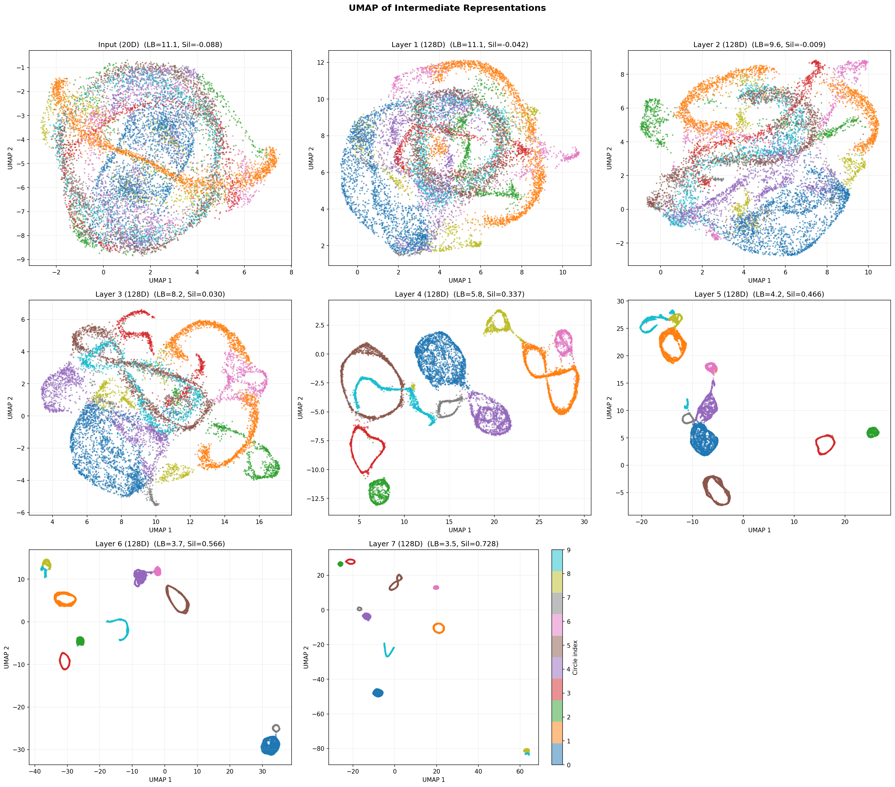

# Synthetic JEPA

Joint Embedding Predictive Architecture (JEPA) for masked prediction on synthetic time series data.

Instead of reconstructing masked observations in pixel/feature space (as in the BERT-style model in `synthetic-bert`), JEPA predicts **representations** of masked regions in latent space.

## Architecture

```
Context encoder : Input → mask → Linear(20→D) → RoPE Transformer (N layers) → D-dim reps
Target encoder  : Input (full) → Linear(20→D) → RoPE Transformer (N layers) → D-dim reps
                  (exponential moving average of context encoder, no gradients)
Predictor       : Context reps → replace masked with [PRED] token
                  → RoPE Transformer (M layers) → LayerNorm → Linear → D-dim predictions
Loss            : MSE(predictions[mask], target_reps[mask])
```

The target encoder is updated via EMA after each optimiser step, with a cosine momentum schedule from τ_base (0.996) → 1.0. The asymmetric architecture (shallow predictor + EMA target) prevents representation collapse without explicit regularisation.

### Default model (7-layer, 1.8M params)

| Component | Value |
|-----------|-------|
| d_model | 128 |
| n_heads | 4 |
| n_layers | 7 |
| d_ff | 512 |
| predictor_n_layers | 2 |
| seq_len | 2048 |
| mask_ratio | 0.25 |
| mask_patch_size | 16–256 |

## Dataset

The synthetic dataset consists of 10 circles embedded in 20D ambient space with a shared 4D subspace (`--subspace-dim 4`). Dynamics are governed by a sparse random Markov transition matrix (each circle transitions heavily to 2–3 others and lightly to 3–4 more).

**Plane drift (`--drift`)**: Even-numbered circles (0, 2, 4, 6, 8) undergo gradual plane tilting during each visit — the 2D plane rotates toward a random orthogonal axis over the course of the syllable, then resets to its original orientation on the next visit. This introduces within-syllable non-stationarity that the model must learn to handle. The `--drift-rate` parameter controls the maximum tilt angle per syllable (default 0.5 rad; use 6.283 for one full rotation per visit).

## Results

Both models trained for 3000 epochs on the drift dataset (`--drift --drift-rate 6.283`), seq_len=2048, mask patches 16–256 at 25% ratio.

### JEPA representations (7 layers)



### BERT baseline representations (7 layers, RoPE)



| Layer | JEPA Sil | BERT Sil |
|-------|----------|----------|
| Input | -0.088 | -0.088 |
| Layer 4 | 0.599 | 0.337 |
| Layer 5 | 0.651 | 0.466 |
| Layer 6 | 0.668 | 0.566 |
| Layer 7 | **0.714** | **0.728** |

JEPA learns better-separated representations in earlier layers, while BERT catches up at the final layer with long context (2048 steps).

## GPU Optimisations

BF16 mixed precision, `torch.compile` (Inductor backend), multi-worker DataLoader, `pin_memory`, `cudnn.benchmark`, `zero_grad(set_to_none=True)`.

## Setup

```bash
python -m venv venv
source venv/bin/activate
pip install numpy matplotlib torch scipy umap-learn
```

## Usage

### Generate dataset

```bash
# Static circles
python markov_circles_timeseries.py --subspace-dim 4 --no-umap

# With plane drift (even circles tilt one full rotation per syllable)
python markov_circles_timeseries.py --subspace-dim 4 --drift --drift-rate 6.283 --no-umap
```

### Train

```bash
python jepa_model_gpu.py --n-layers 7 --mask-patch-max 256 --mask-ratio 0.25 --seq-len 2048 --epochs 3000
```

### Evaluate representations (UMAP + Levina-Bickel)

```bash
python evaluate_representations.py --checkpoint jepa_model.pt --layers input,1,2,3,4,5,6,7
```

## Files

| File | Description |
|------|-------------|
| `jepa_model_gpu.py` | JEPA model definition and GPU-optimised training loop |
| `dataset.py` | `SyntheticSongDataset` — sliding-window + patch masking |
| `masked_model_gpu.py` | Shared `RoPETransformerEncoderLayer` (imported by JEPA) |
| `evaluate_representations.py` | UMAP visualisation and Levina-Bickel intrinsic dimension |
| `estimate_dimension.py` | Levina-Bickel estimator |
| `markov_circles_timeseries.py` | Synthetic dataset generator |
