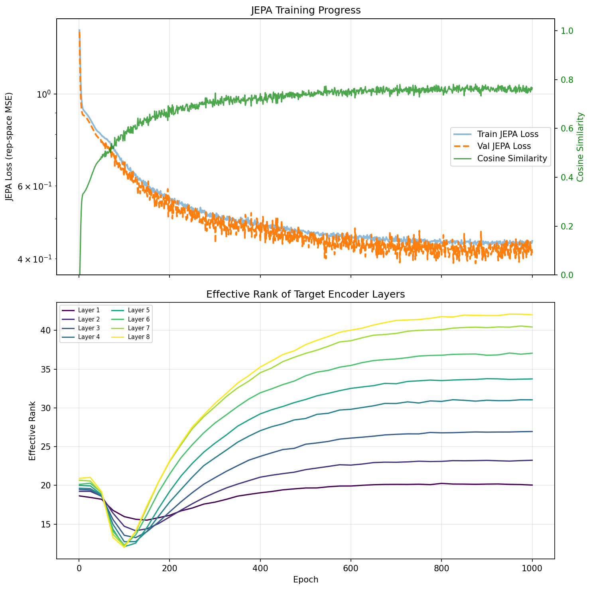
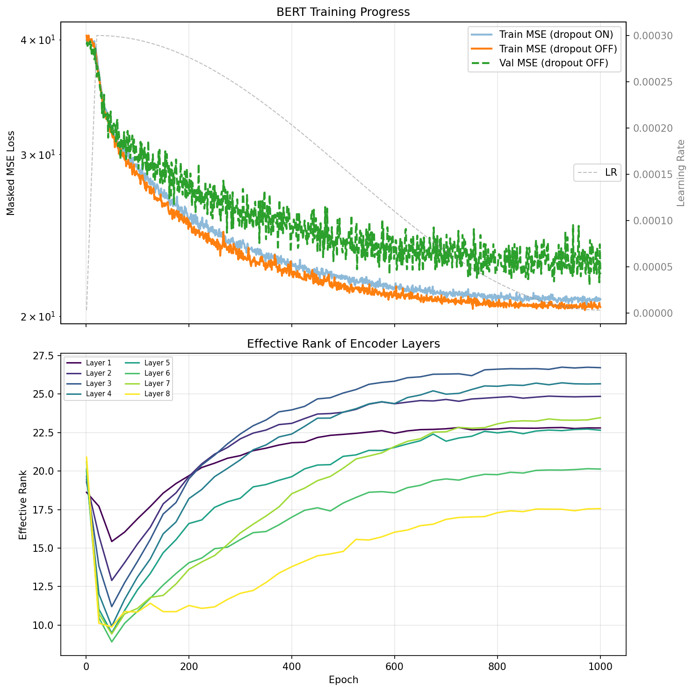

# JEPA vs BERT: Representation Quality Under Noise

A controlled comparison of JEPA (Joint Embedding Predictive Architecture) and BERT-style masked autoencoders on synthetic time series, focusing on two questions:

1. **Which architecture learns better concept-level representations under high observation noise?**
2. **How does the effective rank of learned representations differ between the two architectures?**

## Architecture

```
JEPA
  Context encoder : Input → mask → Linear(20→D) → RoPE Transformer (N layers) → D-dim reps
  Target encoder  : Input (full) → Linear(20→D) → RoPE Transformer (N layers) → D-dim reps
                    (exponential moving average of context encoder, no gradients)
  Predictor       : Context reps → replace masked with [PRED] token
                    → RoPE Transformer (M layers) → LayerNorm → Linear → D-dim predictions
  Loss            : MSE(predictions[mask], target_reps[mask])

BERT
  Encoder         : Input → mask → Linear(20→D) → RoPE Transformer (N layers) → D-dim reps
  Output head     : Linear(D→20)
  Loss            : MSE(reconstruction[mask], observations[mask])
```

Both models share identical encoder architectures (d_model=128, 4 heads, RoPE positional encoding) and training setup (AdamW, cosine LR schedule, BF16 mixed precision, 1000 epochs, batch 128).

| | JEPA | BERT |
|---|---|---|
| **Objective** | Predict target encoder representations at masked positions | Reconstruct raw observations at masked positions |
| **Target** | EMA copy of context encoder (no gradients) | Ground truth observations |
| **Predictor** | 2-layer transformer | Linear projection to 20D |
| **Masking** | 50%, patch size 10–600 | 50%, patch size 10–600 |

The key architectural difference: JEPA predicts in **representation space** (128D, learned), while BERT predicts in **observation space** (20D, fixed).

## Dataset

The synthetic dataset consists of 10 circles embedded in 20D ambient space, drawn from a shared 4D subspace (`subspace_dim=4`). A Markov chain governs transitions between circles, with ~400 time steps per visit ("syllable"). Each circle has a distinct angular velocity and 2D plane orientation.

Two dataset variants are used:

| Variant | noise_std | Random walk | walk_drift_rate | Key challenge |
|---------|-----------|-------------|-----------------|---------------|
| **Noisy** | 5.0 | No | — | High i.i.d. Gaussian noise (SNR ≈ 0.8) |
| **Random walk + noise** | 4.2 | Yes | 0.60 | Noise + within-syllable drift in radius and tilt |

The noisy dataset is the harder test of JEPA's core advantage: when individual timesteps are nearly pure noise, the circle signal is only recoverable by aggregating across many timesteps.


## Result 1: Depth scaling on noisy data (noise_std ≈ 5)

Both models trained at 6, 8, and 12 encoder layers on the high-noise dataset. Silhouette scores measured in UMAP 2D space on the final encoder layer, coloured by circle identity.

### Silhouette scores (final encoder layer)

| Depth | JEPA | BERT | JEPA / BERT |
|-------|------|------|-------------|
| 6L | 0.447 | 0.209 | 2.1× |
| 8L | 0.564 | 0.205 | 2.8× |
| 12L | 0.565 | 0.423 | 1.3× |

### 8-layer UMAPs (noisy data)

**JEPA 8L** — clean circle separation from layer 5 onward (silhouette 0.56):


**BERT 8L** — circles begin separating only at layers 7–8 (silhouette 0.21):


### 6-layer and 12-layer UMAPs

<details>
<summary>6-layer UMAPs</summary>

**JEPA 6L** (silhouette 0.45):


**BERT 6L** (silhouette 0.21):


</details>

<details>
<summary>12-layer UMAPs</summary>

**JEPA 12L** (silhouette 0.57):


**BERT 12L** (silhouette 0.42):


</details>

### Key findings

- **JEPA is consistently better** at every depth on the noisy dataset.
- **JEPA saturates at 8 layers** — going from 8L to 12L yields no improvement (0.564 → 0.565). The representation-level objective extracts the latent structure efficiently with moderate depth.
- **BERT benefits much more from depth** — jumping from 0.21 (6L/8L) to 0.42 (12L). The reconstruction objective needs more capacity to develop abstract representations as a byproduct.
- **JEPA's advantage is largest at moderate depth** (8L, 2.8×), where it has already achieved near-peak performance while BERT has not.
- **BERT's output projection destroys structure** — silhouette drops to negative values at the output layer at every depth, confirming the reconstruction head pulls representations back toward noisy observation space.

## Result 2: Effective rank analysis

Effective rank measures how many dimensions of the 128D representation space carry substantial variance, computed as exp(Shannon entropy) of the normalised squared singular values of the activation matrix. High rank = diverse, orthogonal features; low rank = collapsed, redundant.

Both models trained on the random walk dataset (walk_drift_rate=0.60, noise_std≈4.2) for 1000 epochs with 8-layer encoders. Effective rank measured every 25 epochs on validation data.

### JEPA: effective rank increases with depth



Final effective rank by layer: L1=20 → L3=27 → L5=34 → L8=42.

### BERT: effective rank decreases with depth



Final effective rank by layer: L1=23 → L3=23 → L5=20 → L8=18.

### Comparison

| | JEPA | BERT |
|---|---|---|
| **Rank vs depth** | Increases (20 → 42) | Decreases (23 → 18) |
| **Rank vs time** | Monotonically increasing after epoch ~150 | Slowly increasing, but deeper layers lag |
| **Final layer rank** | 42 | 18 |
| **Early dip** | All layers dip to ~12 at epoch 100 | All layers dip to ~10 at epoch 50 |

### Interpretation

The two architectures produce opposite rank gradients through depth because of their prediction targets:

**JEPA** predicts in representation space (128D, learned). There is no low-dimensional anchor — the encoder is free to expand into whatever dimensionality makes the prediction task easier. Each additional factor of variation encoded (circle identity, phase, radius drift, tilt) adds dimensions, and the objective rewards this. Deeper layers, having richer context from accumulated self-attention, expand the most.

**BERT** predicts in observation space (20D, fixed). The output projection forces the final layer to compress its 128D representations back to 20D. This creates a dimensionality funnel: deeper layers must progressively discard information to prepare for the low-dimensional reconstruction target. The result is decreasing effective rank approaching the output head.

This rank gradient explains the UMAP results:
- JEPA's high-rank deeper layers can maintain well-separated clusters because they have many orthogonal dimensions to spread circle identities apart.
- BERT's low-rank deeper layers must compress cluster structure into fewer dimensions, leading to more overlap and lower silhouette scores.

The combination of **high effective rank** (many active dimensions globally) with **low Levina-Bickel intrinsic dimension** (geometrically simple local structure) is the signature of good concept-level representations: the model uses its full capacity to separate a few discrete concepts cleanly.

## Setup

```bash
python -m venv venv
source venv/bin/activate
pip install numpy matplotlib torch scipy umap-learn
```

## Usage

### Generate dataset

```bash
# High-noise regime (noise_std ≈ 5, where JEPA outshines BERT)
python markov_circles_timeseries.py --subspace-dim 4 --drift --noise-scale 1.77 --no-umap

# Random walk + moderate noise
python markov_circles_timeseries.py --subspace-dim 4 --random-walk \
    --walk-drift-rate 0.60 --noise-scale 1.5 --no-umap
```

### Train

```bash
# JEPA (default: 8L encoder, 2L predictor, 50% masking, seq 1000)
python jepa_model_gpu.py --epochs 1000 --checkpoint jepa_model.pt

# JEPA with effective rank tracking
python jepa_model_erank.py --epochs 1000 --checkpoint jepa_model_erank.pt

# BERT (matching JEPA's encoder config)
cd ../synthetic-bert
python masked_model_gpu.py --seq-len 1000 --mask-ratio 0.5 \
    --mask-patch-min 10 --mask-patch-max 600 --n-layers 8 \
    --epochs 1000 --pos-encoding rope --checkpoint bert_model.pt
```

### Evaluate representations

```bash
# UMAP + silhouette scores
python evaluate_representations.py --checkpoint jepa_model.pt --sil

# UMAP only (faster)
python evaluate_representations.py --checkpoint jepa_model.pt
```

## Files

| File | Description |
|------|-------------|
| `jepa_model_gpu.py` | JEPA model definition and GPU-optimised training loop |
| `jepa_model_erank.py` | JEPA training with per-layer effective rank tracking |
| `dataset.py` | `SyntheticSongDataset` — sliding-window + patch masking |
| `masked_model_gpu.py` | Shared `RoPETransformerEncoderLayer` (imported by JEPA) |
| `evaluate_representations.py` | UMAP visualisation, Levina-Bickel dimension, silhouette scores (GPU-accelerated) |
| `estimate_dimension.py` | Levina-Bickel estimator (GPU-accelerated) |
| `markov_circles_timeseries.py` | Synthetic dataset generator (circles, drift, random walk, noise) |
| `TECHNICAL.md` | Extended notes: architecture details, all experiment runs, hyperparameter strategies |

## References

- Assran et al. (2023). *Self-Supervised Learning from Images with a Joint-Embedding Predictive Architecture*. CVPR 2023. [[arXiv]](https://arxiv.org/abs/2301.08243)
- LeCun (2022). *A Path Towards Autonomous Machine Intelligence*. [[openreview]](https://openreview.net/forum?id=BZ5a1r-kVsf)
- Bardes et al. (2024). *V-JEPA: Latent Video Prediction for Visual Representation Learning*. [[openreview]](https://openreview.net/forum?id=WFYbBOEOtv)
- Grill et al. (2020). *Bootstrap Your Own Latent*. NeurIPS 2020. [[arXiv]](https://arxiv.org/abs/2006.07733)
- Baevski et al. (2022). *data2vec*. ICML 2022. [[arXiv]](https://arxiv.org/abs/2202.03555)
- He et al. (2022). *Masked Autoencoders Are Scalable Vision Learners*. CVPR 2022. [[arXiv]](https://arxiv.org/abs/2111.06377)
- Shwartz-Ziv & Tishby (2017). *Opening the Black Box of Deep Neural Networks via Information*. [[arXiv]](https://arxiv.org/abs/1703.00810)
- Bardes, Ponce & LeCun (2022). *VICReg*. ICLR 2022. [[arXiv]](https://arxiv.org/abs/2105.04906)
